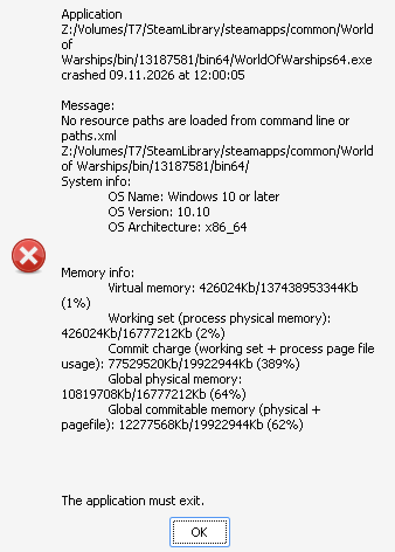

# WOW-Crossover-patcher

[English](./README_EN.md) · 中文

战舰世界（World of Warships）在 macOS 上通过 CrossOver 可以跑起来——只是客户端自己拒绝启动。

图形或 DirectX 还没跑起来之前，客户端会问 Wine 主机操作系统是什么，发现 `Darwin`，打印 **"Sorry, unsupported operating system: macOS support has been discontinued"**，然后退出。其实什么都没坏，只是客户端不肯继续。

本工具翻转那一处检查，也可以再翻回去。

```
WorldOfWarships64.exe
  -> platform64.dll!getHostVersionFromWine()
     -> ntdll!wine_get_host_version()
        -> 主机系统名转小写
           -> 包含 "darwin"?  -> 拒绝启动
```

让 `getHostVersionFromWine()` 返回 `0` 即可去掉拒绝。改动只有三个字节：

```
31 C0        xor eax, eax
C3           ret
```

## 这是什么

**WoWs Mac Patcher** —— macOS 图形应用（Rust + Tauri 2 + React）。

| | |
| --- | --- |
| 代码 | `src-tauri/` + `src/` |
| 开发 | `npm install && npm run tauri dev` |
| 打包 | `npm run release:mac`（产物在 `out/`） |
| 系统要求 | macOS 13+，已安装 CrossOver 与战舰世界 |

功能：查看状态、打补丁、还原、清理 `._` 元数据、环境与日志诊断。

## 由来

拒绝信息是字符串，字符串一定在某个二进制里；引用它的代码就是值得看的检查。顺着调用链会到上面那条路径：`WorldOfWarships64.exe` 问 `platform64.dll!getHostVersionFromWine()`，后者再问 Wine 主机 OS，得到 `Darwin`。

真正推动我动手的是
[这篇 CodeWeavers 论坛帖](https://www.codeweavers.com/compatibility/crossover/forum/world-of-warships?msg=358452)：同样的分析，而且有人已经打过补丁、游戏能跑。感谢他们先发出来。

与那篇帖刻意不同的一点是**偏移**。帖子写死了文件偏移 `0x570`，并明确警告更新后不要直接复用。本工具**从不硬编码偏移**：每次从 DLL 导出表重新解析补丁点。这很重要——同一构建号的 Steam 安装上，正确偏移是 `0x5B0`，而 `0x570` 会落在无关函数的指令中间。

## 使用

1. 用 `npm run release:mac` 打包，或从 `out/` 打开已构建的 `.app`
2. 启动应用，确认安装路径与状态（只读，默认视图）
3. 确认后点击打补丁；需要还原时用还原

`status` 永远只读。`patch` / `clean` 必须经过确认。需要 root 的主机名修复**不会自行提权**，只会给出命令并支持「在终端中打开」。

### 状态

| 状态 | 含义 | 打补丁 | 还原 |
| --- | --- | --- | --- |
| `ORIGINAL` | 未打补丁 | 可以 | — |
| `PATCHED` | 本工具已打补丁，备份校验通过 | — | 可以 |
| `FOREIGN` | 已修改，但备份缺失、过期或本身已是补丁后的文件 | 否 | 否 |
| `UNRESOLVED` | 找不到要补丁的函数 | 否 | 否 |

落到 `FOREIGN` 时请用启动器取得干净 DLL——Steam 的「验证游戏文件完整性」，或战网/Wargaming Game Center 的「检查并修复」——再重来。

### 状态存哪

- `platform64_bck.dll` —— 备份，与原 DLL 同目录
- `~/Library/Application Support/WoWsMacPatcher/state.json` —— 构建号、偏移、原始/补丁后 SHA-256、时间戳

## 如何保证安全

**偏移每次解析，从不记忆。** 论坛帖的 `0x570` 只对某一个构建有效。每次运行解析 PE 导出表，找到名称包含 `getHostVersionFromWine` 的导出，经节表把 RVA 换成文件偏移。游戏更新后偏移会变，工具跟着变。

**宁可停下，也不瞎猜。** 导出缺失、匹配多于一个、是 forwarder、或落在不可执行节里时，报告 `UNRESOLVED` / `FOREIGN`，拒写。

**备份只从原版生成。** 仅当补丁点**尚未**是 `31 C0 C3` 时才创建备份，避免「打补丁 → 更新 → 再打补丁 → 备份被已打补丁文件覆盖」那种灾难。

**写入是原子的。** 先写同目录临时文件，再替换原文件，避免外置盘中途掉线留下半截 DLL。

## 游戏更新之后

补丁不会跟着更新走，也不应该。启动器用新的 `platform64.dll` 覆盖是安全结果。打开应用再打一次即可；偏移会对新构建重新推导。

`patch` 也会顺带清理更新留下的 macOS `._` 元数据文件（见下）。

## 故障排除

### "No resource paths are loaded from command line or paths.xml"

启动后立刻崩溃，多半是第一次在 Mac 上跑完更新之后。补丁本身没问题；更新在游戏目录留下了成上千个隐藏的 `._` 文件。



在应用里用 **清理**。外置盘多为 exFAT，无法存扩展属性，macOS 就写成旁车文件；Wine 会把它们当成普通文件，客户端去解析 `._basecontent.idx` 就会失败。

`._*` 清理只删除以 AppleDouble 魔数（`00 05 16 07`）开头的文件；旁车只有元数据，没有游戏数据。把游戏放在 APFS 盘上可避免再生，但 Windows 读不了 APFS。

## 风险

请认真读这一段。

- 会修改带签名的游戏文件，DLL 数字签名将不再有效。
- 可能与 Wargaming 服务条款冲突，后果只能以官方为准。
- 未来的完整性或反作弊检查可能拒绝被改过的 DLL；若有异议请立刻还原。
- 启动器可能用更新或「验证完整性」覆盖 DLL——那是安全结果，再打一次补丁即可。
- 不碰《坦克世界》、`WorldOfWarships64.exe`、Wine、CrossOver 或注册表。唯一会删的是确认后的 macOS `._` 旁车。

使用风险自负。

## 开发

```bash
npm install
npm run tauri dev

# 测试（PE 夹具由 Rust 在测试时合成，无需 mingw）
cargo test --manifest-path src-tauri/Cargo.toml --lib

# 打包
npm run release:mac
```

```
src-tauri/src/patcher/
  pe.rs           PE 读取：导出、导入、节、RVA 换算
  locate.rs       安装发现与当前构建解析
  patch.rs        状态机、备份规则、原子写入
  appledouble.rs  查找并删除会搞崩客户端的 '._' 旁车
  manifest.rs     持久化补丁记录
  diag.rs         环境与日志诊断
  fixture.rs      测试用合成 PE64 DLL（仅 #[cfg(test)]）
src/              React 前端
```

## 实测

在 **macOS 26.5.1 (25F80)**、**CrossOver 26.2** 上，通过 **Steam** 游玩构建 **13015811**，补丁文件偏移 `0x5B0`，可正常运行。这是 Steam 版 `platform64.dll`（资源里写作 `"Steam Intergation Module"`）；同版本号的 Wargaming Game Center 二进制不同，所以论坛帖的 `0x570` 在这里不适用。
